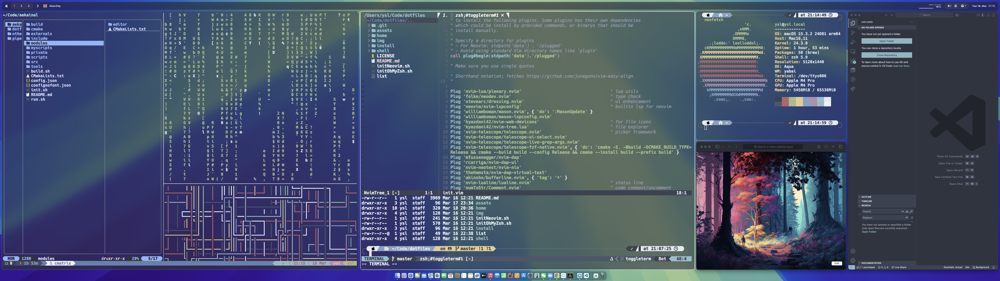

# Dotfiles

My development enviroment configruations. For Windows, linux and macOS.

## Dependencies

There are some optional dependencies that could improve your using experiences. Such as font and icon.

### Font

[Hack Nerd Font](https://github.com/ryanoasis/nerd-fonts#option-4-homebrew-fonts) is required.

Install on macOS:

>brew tap homebrew/cask-fonts
>brew install --cask font-hack-nerd-font


### sf-symbols

This is a system icon framework for macOS.

>brew install --cask sy-symbols


## Neovim
Currently, [vim-plug](https://github.com/junegunn/vim-plug) is used to manage my neovim plugins, though most of configure files are written in lua. So this plugin must be installed first.

dotfile:

```
{HOME}/.config/nvim
```

## Tiling Window Manager on macOS

I use the combination ```Yabai```, ```skhd``` and ```SketchyBar```

For more detail please references their repositories.

dotfile:
```
{HOME}/.config/yabai
{HOME}/.config/skhd
{HOME}/.config/sketchybar
```

I copy most of configurations from [FelixKratz](https://github.com/FelixKratz), who is the author of ```SketcyBar```.

## Terminal

[Alacritty](https://github.com/alacritty/alacritty) is an excellent cross-platform terminal. It could work on all three platforms very well.

dotfile:

```
{HOME}/.config/alacritty/alacritty.yml
```

## git

dotfile:

```
{HOME}/.config/.gitconfig
```

using [delta](https://github.com/dandavison/delta) as the diff tool

## tmux

```
{HOME}/.config/.tmux.conf
```

1. [Solve](https://gist.github.com/andersevenrud/015e61af2fd264371032763d4ed965b6) the problem that colortheme is wrong when open vim/neovim in tmux using Alacritty.

## Lazygit

```
{HOME}/.config/lazygit/
```

## Awesome

```
{HOME}/.config/awesome
```
